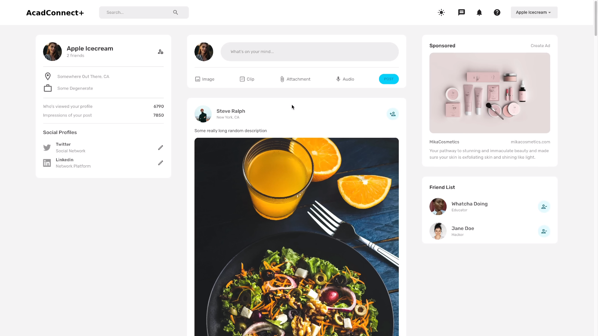

# AcadConnect+

Welcome to AcadConnect+ - a full-stack responsive MERN application for connecting learners and creators!

### Light Mode


### Dark Mode


## Features

- User Authentication: Register, log in, and log out securely.
- Post Creation: Share educational content, ideas, and thoughts with the community.
- Likes: Show appreciation for posts with the like feature.
- Dark Mode: Toggle between light and dark mode for a comfortable reading experience.
- Responsive Design: Enjoy a seamless experience across different devices and screen sizes.

## Technologies Used

- Frontend: React.js, Material-UI (MUI)
- Backend: Node.js, Express.js
- Database: MongoDB
- Authentication: JSON Web Tokens (JWT)
- Other: Axios (HTTP requests), CSS-in-JS for styling

## Installation

1. Clone this repository: `git clone https://github.com/raouffilali/AcadConnect-Forum.git`
2. Navigate to the project folder: `cd acadconnect-plus`
3. Install frontend dependencies: `cd client && npm install`
4. Install backend dependencies: `cd ../server && npm install`
5. Create a `.env` file in the `server` directory and set your MongoDB connection URL and JWT secret key.
   ```
   MONGODB_URI=your-mongodb-uri
   JWT_SECRET=your-secret-key
   ```
6. Start the development server: `npm run dev`

## Usage

1. Open your browser and go to `http://localhost:3000` to access the AcadConnect+ application.
2. Register a new account or log in with your existing credentials.
3. Explore posts, create new posts, like posts, and toggle dark mode for a personalized experience.

## Contributing

Contributions are welcome! If you have any issues or ideas for improvements, please submit a pull request.
Special Thanks to [EdRoh](https://www.youtube.com/@EdRohDev) For the best practise for this forum


## License

This project is licensed under the [MIT License](LICENSE).

---
  
